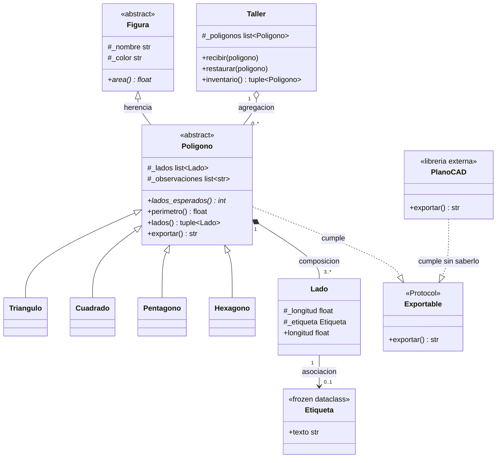

# Diagrama de clases final — TP Integrador Unidad 3

Refleja las decisiones tomadas en las Partes 3 y 4. Para verlo renderizado,
copiá el bloque de código y pegalo en https://mermaid.live

## Nota sobre PoligonoRegular

No aparece como clase en este diagrama. Se decidio en la Parte 3 que "ser
regular" (todos los lados iguales) no es un tipo de figura distinto: es un
Triangulo, Cuadrado, Pentagono o Hexagono con una restriccion extra sobre sus
lados. Se reemplazo por una funcion `crear_regular(clase, medida)` que
construye cualquiera de las 4 subclases existentes, en vez de agregar una
quinta clase a la jerarquia solo para eso.